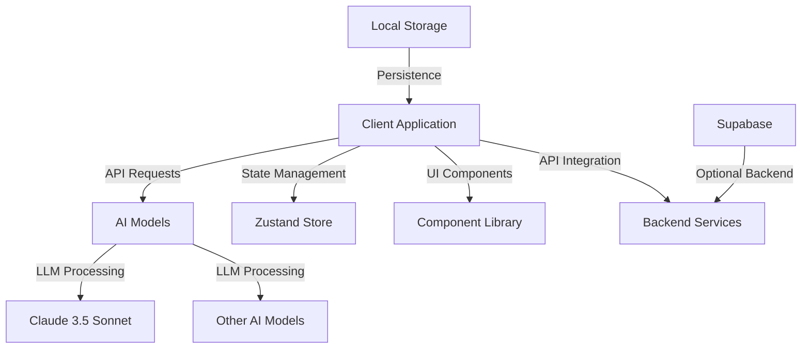
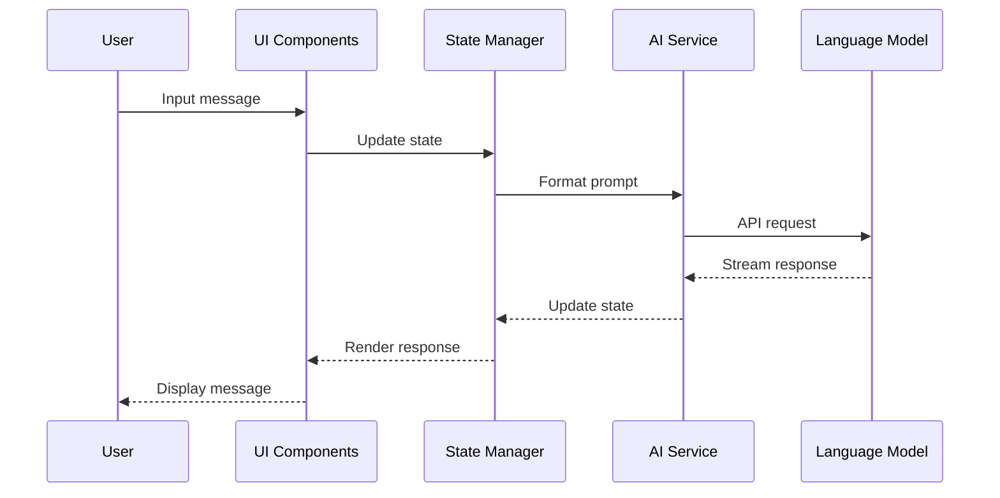
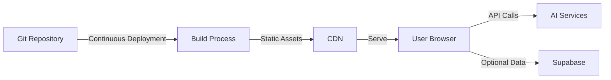

Artifact Chat is built with a modern frontend architecture focused on performance, scalability, and developer experience. This document explains the key components of the system.

## High-Level Overview

Artifact Chat follows a client-centric architecture with AI processing via API services. The main components are:

## Core Components

### Frontend Architecture

Artifact Chat is built with React and follows a component-based architecture:

1. **React Components**: Modular UI components built with React
2. **State Management**: Zustand for state management
3. **Routing**: React Router for client-side routing
4. **Styling**: Tailwind CSS for utility-first styling

### AI Integration Layer

The AI integration layer connects the frontend with large language models:

<Note>
  All AI requests are streamed to provide real-time feedback to users.
</Note>

1. **Model Abstraction**: Unified interface for different AI models
2. **Stream Processing**: Real-time streaming of AI responses
3. **Error Handling**: Robust error handling for AI requests
4. **Rate Limiting**: Client-side rate limiting and tracking

## Data Flow

The typical data flow in Artifact Chat follows these steps:

1. User input is captured through the UI
2. Input is processed and formatted as a prompt
3. The prompt is sent to the LLM API
4. Streaming responses are received and rendered
5. Conversation history is updated and persisted

## Technical Stack

Artifact Chat uses the following technologies:

| Category           | Technologies              |
| ------------------ | ------------------------- |
| Frontend Framework | React                     |
| Build Tool         | Vite                      |
| State Management   | Zustand                   |
| Styling            | Tailwind CSS              |
| UI Components      | Radix UI, Shadcn UI       |
| Forms              | React Hook Form, Zod      |
| AI Integration     | Anthropic SDK, OpenAI SDK |
| Routing            | React Router              |
| HTTP Client        | Axios                     |
| Testing            | Jest                      |

## Performance Optimizations

Artifact Chat implements several performance optimizations:

1. **Component Memoization**: React.memo for expensive components
2. **Lazy Loading**: Dynamic imports for code-splitting
3. **Request Batching**: Batching of AI requests when appropriate
4. **Cache Management**: Caching of common responses
5. **State Normalization**: Optimized state structure

<Warning>
  AI processing can be resource-intensive. Monitor token usage and implement
  rate limiting to control costs.
</Warning>

## Deployment Architecture

For production deployments, we recommend a JAMstack approach:

## Security Considerations

The architecture includes several security features:

1. **API Key Management**: Secure handling of API keys
2. **Input Validation**: Validation of all user inputs
3. **Content Filtering**: Optional filtering of AI responses
4. **Rate Limiting**: Prevention of API abuse
5. **Authentication**: Optional user authentication
