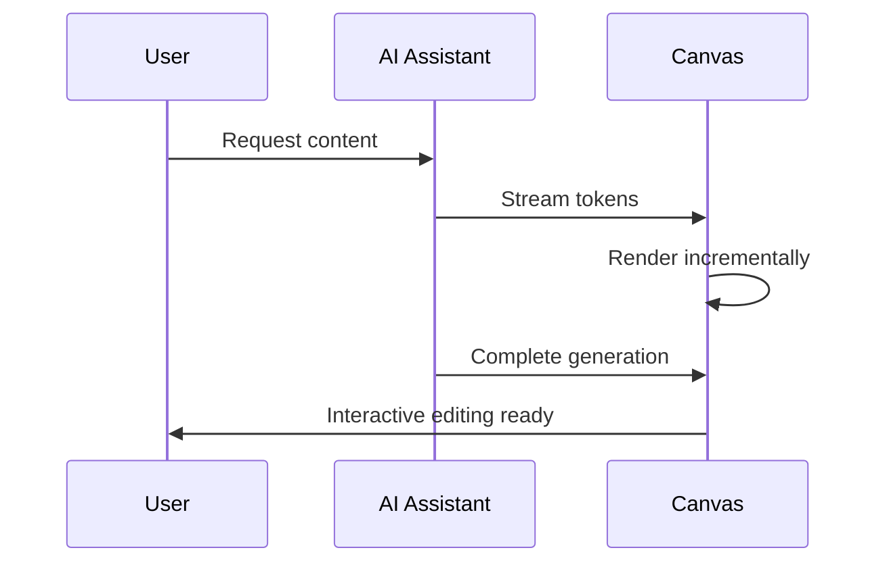

The Canvas System is a powerful feature in Artifact Chat that provides interactive editing for various content types. When the AI generates content like code, documents, spreadsheets, or web pages, it can automatically open in a dedicated canvas for real-time editing and collaboration.

## Canvas Types

Artifact Chat supports four distinct canvas types, each optimized for different content:

### Text Canvas

The Text Canvas provides a rich text editing experience powered by BlockNote:

- **Rich Text Editing**: Full markdown support with WYSIWYG editing
- **Formatting Options**: Headings, lists, bold, italic, links, and more
- **Real-time Updates**: Content streams in as the AI generates it
- **Export Options**: Save as Markdown, PDF, or DOCX

<Note>
  The Text Canvas is ideal for documents, articles, reports, and any text-based content.
</Note>

### Code Canvas

The Code Canvas offers a professional coding environment with CodeMirror:

- **Syntax Highlighting**: Support for 100+ programming languages
- **Live Preview**: Sandpack-powered live preview for web technologies
- **Code Formatting**: Automatic indentation and formatting
- **Multiple Files**: Support for multi-file projects

<Tabs>
  <Tab title="Features">
    - Syntax highlighting for all major languages
    - Live preview for React, Vue, HTML/CSS/JS
    - Code folding and line numbers
    - Search and replace functionality
  </Tab>
  <Tab title="Supported Languages">
    - JavaScript/TypeScript
    - Python
    - React/JSX
    - HTML/CSS
    - Go, Rust, Java, C++
    - And many more...
  </Tab>
</Tabs>

### Spreadsheet Canvas

The Spreadsheet Canvas provides Excel-like functionality:

- **Large Data Support**: Up to 1000 rows × 100 columns
- **CSV Import/Export**: Easy data exchange
- **Formulas**: Basic spreadsheet calculations
- **Sorting & Filtering**: Organize your data efficiently

### HTML Canvas

The HTML Canvas enables web development with live preview:

- **Live Preview**: See changes in real-time
- **Component Library**: Access to pre-built UI components
- **Responsive Testing**: Preview at different screen sizes
- **Export Options**: Download as standalone HTML

## How Canvas Works

### Auto-Detection

The Canvas System automatically detects the content type from AI responses:

1. **Code Blocks**: Trigger Code Canvas with syntax highlighting
2. **Markdown Content**: Opens in Text Canvas
3. **CSV/Table Data**: Opens in Spreadsheet Canvas
4. **HTML Markup**: Opens in HTML Canvas

### Real-time Streaming

Content streams directly into the canvas as the AI generates it:

### Version History

Every canvas maintains a complete version history:

- **Automatic Saves**: Changes are saved automatically
- **Version Rollback**: Restore any previous version
- **Diff View**: Compare versions side-by-side
- **Branch Versions**: Create alternative versions from any point

## Using the Canvas

### Opening a Canvas

The canvas opens automatically when:

1. The AI generates substantial code or content
2. You request document creation
3. You ask for data analysis or visualization
4. You request web page creation

You can also manually open a canvas from the chat interface.

### Editing Content

Once content is in the canvas:

1. **Direct Editing**: Click and type to make changes
2. **AI Assistance**: Ask the AI to modify specific parts
3. **Formatting**: Use toolbar or keyboard shortcuts
4. **Preview**: See live preview for code and HTML

### Exporting Content

Export your canvas content in multiple formats:

| Canvas Type | Export Formats |
|-------------|----------------|
| Text | Markdown, PDF, DOCX |
| Code | Source files, ZIP archive |
| Spreadsheet | CSV, Excel |
| HTML | HTML file, ZIP with assets |

<Warning>
  PDF and DOCX exports are processed through the backend API. Ensure you're connected to generate these formats.
</Warning>

## Canvas Features

### Collaboration

Share your canvas content with others:

- **Social Sharing**: Share links on social platforms
- **Direct Links**: Generate shareable URLs
- **Embed Options**: Embed in other applications

### Keyboard Shortcuts

| Shortcut | Action |
|----------|--------|
| `Cmd/Ctrl + S` | Save current version |
| `Cmd/Ctrl + Z` | Undo |
| `Cmd/Ctrl + Shift + Z` | Redo |
| `Cmd/Ctrl + /` | Toggle comment (Code) |
| `Cmd/Ctrl + B` | Bold (Text) |

### Editing Placeholder

When a canvas is open, an editing placeholder appears in the message thread, indicating that content is being edited in the canvas view.

## Best Practices

1. **Use Appropriate Canvas**: Let auto-detection choose, or specify the content type
2. **Save Frequently**: While auto-save is enabled, explicit saves create named versions
3. **Use Version History**: Don't fear making changes - you can always rollback
4. **Export Early**: Save important content to your local system
5. **Iterate with AI**: Use the AI to refine canvas content through conversation

## Next Steps

<CardGroup>
  <Card title="Projects" icon="folder" href="/concepts/projects">
    Learn about project organization
  </Card>
  <Card title="Tools" icon="wrench" href="/concepts/tools">
    Explore the available AI tools
  </Card>
  <Card title="Customizing Assistants" icon="robot" href="/guides/customizing-assistants">
    Create specialized AI assistants
  </Card>
</CardGroup>
