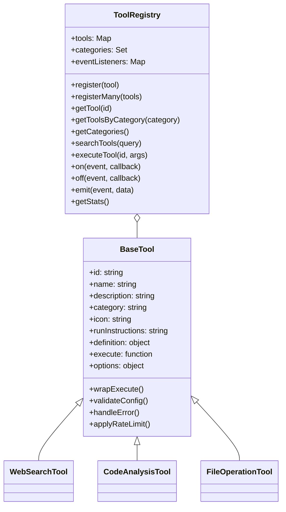

The Artifact Chat Tool Library provides a collection of specialized AI-powered tools that extend the capabilities of the assistant. These tools allow the AI to perform specific tasks like web searches, code analysis, and file operations.

## Tool Architecture

Each tool in the library is built on a consistent architecture:

<CodeGroup>

</CodeGroup>

### BaseTool

The `BaseTool` class is the foundation of the tool library. Every tool extends this class, ensuring a consistent interface and behavior. The key components of a tool include:

- **ID**: Unique identifier for the tool
- **Name**: Human-readable name
- **Description**: Purpose and functionality overview
- **Category**: Tool classification for organization
- **Icon**: Visual representation
- **Run Instructions**: Guidance for how to use the tool
- **Definition**: JSON Schema definition of tool parameters and outputs
- **Execute Function**: Implementation of the tool functionality

### ToolRegistry

The `ToolRegistry` manages the collection of available tools, providing:

- Tool registration and organization
- Category-based filtering
- Tool search capabilities
- Execution management
- Event system for monitoring tool usage

## Tool Categories

Artifact Chat organizes tools into the following categories with distinctive color coding:

| Category                | Description                        | Color                                            |
| ----------------------- | ---------------------------------- | ------------------------------------------------ |
| **Images**              | Image generation and analysis      | <span style={{color: "#d946ef"}}>Fuchsia</span>  |
| **Web**                 | Internet search and scraping       | <span style={{color: "#22c55e"}}>Green</span>    |
| **Knowledge**           | Information retrieval and analysis | <span style={{color: "#eab308"}}>Yellow</span>   |
| **Data**                | Data visualization and analysis    | <span style={{color: "#6366f1"}}>Indigo</span>   |
| **Code**                | Code analysis and generation       | <span style={{color: "#8b5cf6"}}>Violet</span>   |
| **Files**               | File operations and management     | <span style={{color: "#ef4444"}}>Red</span>      |
| **Analysis**            | Text and data analysis             | <span style={{color: "#3b82f6"}}>Blue</span>     |
| **Context7**            | Documentation access               | <span style={{color: "#0ea5e9"}}>Sky Blue</span> |
| **Firecrawl**           | Advanced web scraping              | <span style={{color: "#f97316"}}>Orange</span>   |
| **Binance**             | Cryptocurrency data                | <span style={{color: "#eab308"}}>Yellow</span>   |
| **Gmail**               | Email management                   | <span style={{color: "#dc2626"}}>Red</span>      |
| **GitHub**              | Repository management              | <span style={{color: "#24292e"}}>Black</span>    |
| **Reddit**              | Reddit interaction                 | <span style={{color: "#ff4500"}}>Orange</span>   |
| **Sequential Thinking** | Step-by-step reasoning             | <span style={{color: "#06b6d4"}}>Cyan</span>     |
| **Google Drive**        | Document management                | <span style={{color: "#2563eb"}}>Blue</span>     |
| **Slack**               | Workspace communication            | <span style={{color: "#7c3aed"}}>Purple</span>   |

## Available Tools

### Web Tools

<CardGroup>
  <Card title="Web Search" icon="magnifying-glass">
    Search the web for real-time information using the Serper API
  </Card>
  <Card title="Places Search" icon="location-dot">
    Search for locations and places using Google Maps integration
  </Card>
  <Card title="Web Scraper" icon="spider-web">
    Extract content from websites using Firecrawl
  </Card>
  <Card title="Site Crawler" icon="globe">
    Crawl websites to extract structured data and information
  </Card>
  <Card title="Web Documentation" icon="book-open">
    Fetch and process documentation from websites
  </Card>
  <Card title="Deep Research" icon="magnifying-glass-chart">
    Perform comprehensive research across multiple sources
  </Card>
</CardGroup>

### Image Tools

<CardGroup>
  <Card title="DALL-E" icon="image">
    Generate images using OpenAI's DALL-E model
  </Card>
  <Card title="Midjourney" icon="palette">
    Generate high-quality images using Midjourney
  </Card>
  <Card title="Stable Diffusion" icon="wand-magic-sparkles">
    Generate images using Stable Diffusion models
  </Card>
  <Card title="Venice" icon="paint-brush">
    Generate uncensored images using Venice Diffusion
  </Card>
  <Card title="NewReality" icon="star">
    Generate NSFW images with NewReality models
  </Card>
  <Card title="Image Analysis" icon="eye">
    Analyze and describe image contents using AI vision
  </Card>
</CardGroup>

### Data Tools

<CardGroup>
  <Card title="Chart Generation" icon="chart-line">
    Create visual charts and graphs from data
  </Card>
  <Card title="CSV Generation" icon="table">
    Generate structured CSV data files
  </Card>
  <Card title="PDF Generation" icon="file-pdf">
    Create PDF documents with formatted content
  </Card>
</CardGroup>

### Code Tools

<CardGroup>
  <Card title="Code Interpreter" icon="code">
    Execute code snippets and interpret results
  </Card>
  <Card title="File Analysis" icon="file-code">
    Analyze code files for structure and patterns
  </Card>
</CardGroup>

### Context7 Documentation

<CardGroup>
  <Card title="Resolve Library ID" icon="book">
    Find the correct library identifier for documentation
  </Card>
  <Card title="Get Library Docs" icon="book-open">
    Retrieve up-to-date documentation for libraries and frameworks
  </Card>
</CardGroup>

### Firecrawl Tools

<CardGroup>
  <Card title="Scrape" icon="spider-web">
    Extract content from specific web pages
  </Card>
  <Card title="Map" icon="sitemap">
    Create site maps of web content structure
  </Card>
  <Card title="Crawl" icon="spider">
    Traverse websites to collect information
  </Card>
  <Card title="Search" icon="search">
    Perform targeted searches within websites
  </Card>
  <Card title="Deep Research" icon="brain">
    Conduct comprehensive research across multiple sites
  </Card>
</CardGroup>

### Binance Tools

<CardGroup>
  <Card title="Get Price" icon="money-bill-trend-up">
    Retrieve current price for cryptocurrency pairs
  </Card>
  <Card title="Get Order Book" icon="book">
    Access current order book data for trading pairs
  </Card>
  <Card title="Get Recent Trades" icon="chart-simple">
    View recent trading activity
  </Card>
  <Card title="Get Klines" icon="chart-line">
    Retrieve candlestick chart data for technical analysis
  </Card>
  <Card title="Get 24hr Ticker" icon="clock">
    Get 24-hour market statistics
  </Card>
</CardGroup>

### Gmail Tools

<CardGroup>
  <Card title="Send Email" icon="paper-plane">
    Compose and send emails
  </Card>
  <Card title="Draft Email" icon="envelope">
    Create email drafts without sending
  </Card>
  <Card title="Search Emails" icon="search">
    Find emails based on queries
  </Card>
  <Card title="Read Email" icon="envelope-open">
    View email content and metadata
  </Card>
  <Card title="Modify Email" icon="pen-to-square">
    Update email properties
  </Card>
  <Card title="Delete Email" icon="trash">
    Remove emails
  </Card>
  <Card title="Manage Labels" icon="tags">
    Create, update, or delete email labels
  </Card>
  <Card title="Batch Operations" icon="layer-group">
    Perform actions on multiple emails at once
  </Card>
</CardGroup>

### GitHub Tools

<CardGroup>
  <Card title="Search Repositories" icon="magnifying-glass">
    Find repositories matching specific criteria
  </Card>
  <Card title="Repository Management" icon="code-branch">
    Get repository information and manage settings
  </Card>
  <Card title="Branch Management" icon="code-fork">
    List and manage repository branches
  </Card>
  <Card title="File Operations" icon="file-code">
    Get, create, or update repository files
  </Card>
  <Card title="Issue Management" icon="circle-exclamation">
    List, create, and update issues
  </Card>
  <Card title="Pull Request Management" icon="code-pull-request">
    List, create, and merge pull requests
  </Card>
  <Card title="Comments" icon="comments">
    Manage comments on issues and pull requests
  </Card>
  <Card title="User Management" icon="users">
    Get user information and manage collaborators
  </Card>
</CardGroup>

### Slack Tools

<CardGroup>
  <Card title="List Channels" icon="hashtag">
    View available Slack channels
  </Card>
  <Card title="Post Message" icon="comment">
    Send messages to channels
  </Card>
  <Card title="Reply to Thread" icon="reply">
    Reply to message threads
  </Card>
  <Card title="Add Reaction" icon="face-smile">
    React to messages with emojis
  </Card>
  <Card title="Get Channel History" icon="clock-rotate-left">
    View message history in channels
  </Card>
  <Card title="Get Thread Replies" icon="comments">
    View replies in a message thread
  </Card>
  <Card title="Get Users" icon="users">
    List users in the workspace
  </Card>
  <Card title="Get User Profile" icon="id-card">
    View detailed user information
  </Card>
</CardGroup>

### Reddit Tools

<CardGroup>
  <Card title="Get Frontpage Posts" icon="newspaper">
    Retrieve trending posts from Reddit's frontpage
  </Card>
  <Card title="Get Subreddit Info" icon="circle-info">
    Get information about specific subreddits
  </Card>
  <Card title="Browse Subreddit Posts" icon="list">
    Access hot, new, top, and rising posts in subreddits
  </Card>
  <Card title="Get Post Content" icon="file-lines">
    View detailed post content
  </Card>
  <Card title="Get Post Comments" icon="comments">
    View comments on Reddit posts
  </Card>
</CardGroup>

### Google Drive Tools

<CardGroup>
  <Card title="List Resources" icon="folder-open">
    View files and folders in Google Drive
  </Card>
  <Card title="Read Resource" icon="file">
    Access content of Google Drive files
  </Card>
  <Card title="Search" icon="search">
    Find files and folders by name or content
  </Card>
  <Card title="List Folders" icon="folder-tree">
    View folder structure in Google Drive
  </Card>
  <Card title="File Info" icon="circle-info">
    Get detailed metadata about Drive files
  </Card>
</CardGroup>

### Sequential Thinking

<CardGroup>
  <Card title="Sequential Thinking" icon="brain">
    Perform step-by-step reasoning for complex problems
  </Card>
</CardGroup>

### File Tools

<CardGroup>
  <Card title="File Search" icon="search">
    Search for files by name or content
  </Card>
  <Card title="File Analysis" icon="file-magnifying-glass">
    Analyze file content and structure
  </Card>
</CardGroup>

## Using Tools

Tools can be invoked by the AI assistant during conversations when needed. For example:

<Note>
  When the user asks a question about current events, the assistant can
  automatically use the Web Search tool to find the most up-to-date information.
</Note>

### Tool Execution Flow

1. The AI determines a tool is needed based on the conversation
2. The appropriate tool is selected from the registry
3. Required parameters are gathered from the context or user input
4. The tool is executed with appropriate rate limiting
5. Results are processed and incorporated into the assistant's response

## Creating Custom Tools

Custom tools can be added to extend the assistant's capabilities. Each tool follows a standard pattern:

```javascript
import { BaseTool } from "../base/BaseTool.js";

// Implement the tool's functionality
export const myToolFunction = async (params) => {
  // Tool implementation
  // ...

  return {
    status: "success",
    result: {
      data: {
        /* result data */
      },
      metadata: {
        /* metadata */
      },
    },
  };
};

// Create the tool instance
export const myTool = new BaseTool({
  id: "tool_id",
  name: "Tool Name",
  description: "Tool description",
  type: "function",
  category: "category",
  icon: "icon-name",
  options: {
    rateLimit: { maxRequests: 10, perMinute: true },
  },
  runInstructions: "How to use this tool",

  definition: {
    type: "function",
    function: {
      name: "function_name",
      description: "Function description",
      parameters: {
        type: "object",
        properties: {
          // Parameter definitions
        },
        required: ["required_params"],
      },
    },
  },

  execute: myToolFunction,
});

export default myTool;
```

## Best Practices

When working with tools:

1. **Tool Selection**: Choose the most appropriate tool for the specific task
2. **Parameter Validation**: Always validate inputs before execution
3. **Error Handling**: Implement robust error handling for failure cases
4. **Rate Limiting**: Respect API rate limits to avoid service disruptions
5. **Result Formatting**: Structure results consistently for easy consumption
6. **Security**: Consider security implications, especially for system operations

## Tool Limitations

- Tools have defined rate limits to prevent abuse
- External services used by tools may have their own limitations
- Tools may require specific API keys or permissions
- Some tools may have usage costs associated with them

## Next Steps

<CardGroup>
  <Card
    title="Customizing Tools"
    icon="wrench"
    href="/guides/customizing-tools"
  >
    Learn how to extend and create custom tools
  </Card>
  <Card
    title="Architecture"
    icon="diagram-project"
    href="/concepts/architecture"
  >
    Learn more about the Artifact Chat architecture
  </Card>
  <Card
    title="Customizing Assistants"
    icon="robot"
    href="/guides/customizing-assistants"
  >
    Learn how to customize your assistant's model and system prompt
  </Card>
</CardGroup>
